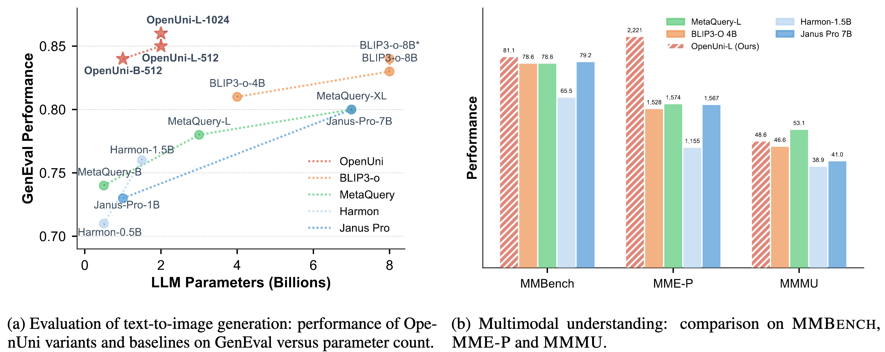

# OpenUni: A Simple Baseline for Unified Multimodal Understanding and Generation



> **[OpenUni: A Simple Baseline for Unified Multimodal Understanding and Generation](https://arxiv.org/abs/2505.23661)**
>
> Size Wu, Zhonghua Wu, Zerui Gong, Qingyi Tao, Sheng Jin, Qinyue Li, Wei Li, Chen Change Loy
>
> [](docs/report.pdf)
> [](https://github.com/wusize/OpenUni?tab=readme-ov-file#-citation)

## Introduction

This is a repo under construction, named OpenUni, an open-source version of [MetaQuery](https://xichenpan.com/metaquery) for unifying multimodal understanding and generation. With a minimalist choice of architecture, we demonstrate that OpenUni can: 1) generate high-quality and instruction-aligned images, and 2) achieve exceptional performance on standard benchmarks such as GenEval, DPG-Bench, and WISE, with only 1.1B and 3.1B activated parameters. Currently, we provide three model variants: OpenUni-B-512, OpenUni-L-512 and OpenUni-L-1024. Checkpoints from both pre-training and fine-tuning are provided.


## 🔥 Model Zoo

| Model Name | Image Size | MLMM Model | Diffusion Model | Pre-trained | Fine-tuned |
|------------|------------|------------|-----------------|-------------|------------|
| OpenUni-B-512 | 512×512 | [InternVL3-1B](https://huggingface.co/OpenGVLab/InternVL3-1B) | [SANA-0.6B-512px](https://huggingface.co/Efficient-Large-Model/Sana_600M_512px_diffusers) | [Link](https://huggingface.co/wusize/openuni/blob/main/openuni_b_internvl3_1b_sana_0_6b_512_hf_text2image23m.pth) | [Link](https://huggingface.co/wusize/openuni/blob/main/openuni_b_internvl3_1b_sana_0_6b_512_hf_blip3o60k.pth) |
| OpenUni-L-512 | 512×512 | [InternVL3-2B](https://huggingface.co/OpenGVLab/InternVL3-2B) | [SANA-1.6B-512px](https://huggingface.co/Efficient-Large-Model/Sana_600M_512px_diffusers) | [Link](https://huggingface.co/wusize/openuni/blob/main/openuni_l_internvl3_2b_sana_1_6b_512_hf_text2image23m.pth) | [Link](https://huggingface.co/wusize/openuni/blob/main/openuni_l_internvl3_2b_sana_1_6b_512_hf_blip3o60k.pth) |
| OpenUni-L-1024 | 1024×1024 | [InternVL3-2B](https://huggingface.co/OpenGVLab/InternVL3-2B) | [SANA1.5-1.6B-1024px](https://huggingface.co/Efficient-Large-Model/SANA1.5_1.6B_1024px_diffusers) | [Link](https://huggingface.co/wusize/openuni/blob/main/openuni_l_internvl3_2b_sana_1_6b_512_hf_text2image23m.pth) | [Link](https://huggingface.co/wusize/openuni/blob/main/openuni_l_internvl3_2b_sana_1_6b_1024_hf_blip3o60k.pth) |


## Environment
```
mmengine
xtuner
transformers
torch
flash_attn
```

## Text-to-Image

Please download our released model weights from 🤗[wusize/openuni](https://huggingface.co/wusize/openuni). It is recommended to use the following command to download the checkpoints


```bash
# pip install -U "huggingface_hub[cli]"
huggingface-cli download wusize/openuni  --local-dir checkpoints --repo-type model
```

```text
OpenUni/
├── checkpoints
    ├── openuni_b_internvl3_1b_sana_0_6b_512_hf_blip3o60k.pth
    ├── openuni_b_internvl3_1b_sana_0_6b_512_hf_text2image23m.pth
    ├── openuni_l_internvl3_2b_sana_1_6b_1024_hf_blip3o60k.pth
    ├── openuni_l_internvl3_2b_sana_1_6b_1024_hf_text2image23m.pth
    ├── openuni_l_internvl3_2b_sana_1_6b_512_hf_blip3o60k.pth
    ├── openuni_l_internvl3_2b_sana_1_6b_512_hf_text2image23m.pth
```

### Inference
Please refer to [docs/INFERENCE.md](docs/INFERENCE.md).

### Evaluation
Please refer to [docs/EVALUATION.md](docs/EVALUATION.md).

### Train

Please refer to [docs/DATASETS.md](docs/DATASETS.md) and [docs/datasets](docs/datasets) to prepare the datasets. After having the datasets,
please follow the instructions in [docs/TRAIN.md](docs/TRAIN.md) to launch training scripts.

## 📚 Citation

If you find OpenUni useful for your research or applications, please cite our paper using the following BibTeX:

```bibtex
@article{wu2025openuni,
      title={OpenUni: A Simple Baseline for Unified Multimodal Understanding and Generation}, 
      author={Size Wu and Zhonghua Wu and Zerui Gong and Qingyi Tao and Sheng Jin and Qinyue Li and Wei Li and Chen Change Loy},
      year={2025},
      eprint={2505.23661},
      archivePrefix={arXiv},
      primaryClass={cs.CV},
      url={https://arxiv.org/abs/2505.23661}, 
}
```

## 📜 License
This project is licensed under [NTU S-Lab License 1.0](LICENSE).


## 🙏 Acknowledgement
The project builds upon the following pioneering works:
- [SANA](https://github.com/NVlabs/Sana): We use SANA as our diffusion module, considering its efficiency and strong performance.
- [InternVL3](https://github.com/OpenGVLab/InternVL): We use the latest InternVL3 as our base multimodal LLM.
- [MetaQuery](https://xichenpan.com/metaquery): OpenUni is inspired by MetaQuery and is an open-source implementation of this work.
- [BLIP3-o](https://github.com/JiuhaiChen/BLIP3o): We thank the BLIP3-o team for releasing the precious high-quality tuning dataset.
